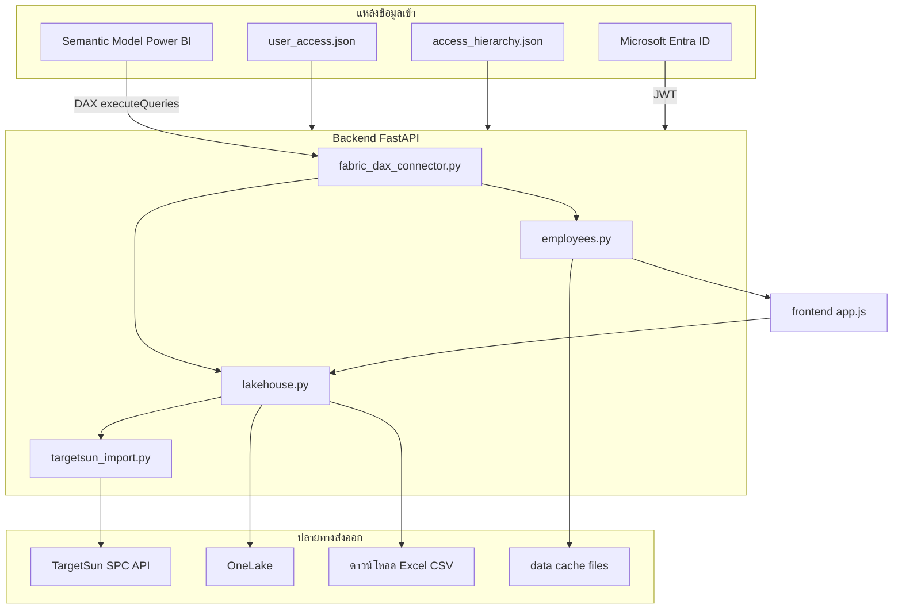

# เอกสารการดึง / ใช้ / ส่งข้อมูล — Target Allocation

อ้างอิงโค้ด `backend/fabric_dax_connector.py` และ services ที่เกี่ยวข้อง

---

## สรุปภาพรวม



---

## 1. Semantic Model (Power BI / Fabric)

### การเชื่อมต่อ

| รายการ | ค่า |
|--------|-----|
| Connector | `backend/fabric_dax_connector.py` → `FabricDAXConnector` |
| API | `POST …/datasets/{FABRIC_DATASET_ID}/executeQueries` |
| Auth | Service Principal (`FABRIC_CLIENT_SECRET`) หรือ interactive user |
| Config | `config/.env` — `FABRIC_CLIENT_ID`, `FABRIC_TENANT_ID`, `FABRIC_DATASET_ID`, `FABRIC_WORKSPACE_ID` |
| Diagnostic | `python scripts/test_powerbi_access.py` |

Frontend **ไม่** เรียก Power BI โดยตรง

---

### 1.1 ตารางที่ดึงใน Runtime

#### `Dim_Salesman`

| คอลัมน์ | การใช้งาน |
|---------|-----------|
| `SuperCode` | จับคู่ Supervisor → รายชื่อพนักงาน |
| `ManagerCode` | ข้อมูล manager (index / validate) |
| `Area_NameThai` | ภาค |
| `SalesType` | 0=credit, 1=van |
| `SalesmanCode` | รหัสพนักงาน |
| `Salesman_NameThai` | ชื่อพนักงาน |

| Method | เรียกจาก |
|--------|----------|
| `get_employees_by_manager()` | `employees.py`, admin team |
| `get_supervisor_name()` | `employees.py` |
| `get_dim_salesman_supervisor_index()` | `scripts/validate_access_with_dim.py` |

#### `Dim_Super`

| คอลัมน์ | การใช้งาน |
|---------|-----------|
| `Code`, `Namethai` | ชื่อ Supervisor |

#### `Dim_Product`

| คอลัมน์ | การใช้งาน |
|---------|-----------|
| `ProductCode`, `Brand`, `Brand_NameThai`, `Product_NameThai`, `Product_NameEnglish`, `Section` | ข้อมูล SKU |

#### `DimDate`

| คอลัมน์ | การใช้งาน |
|---------|-----------|
| `Date` | กรอง YEAR/MONTH สำหรับประวัติขาย |

#### `cross_sold_history_2y_qu`

| คอลัมน์ | การใช้งาน |
|---------|-----------|
| `SalesmanCode`, `ProductCode`, `TotalQuantity`, `Amount`, `WarehouseCode` | ประวัติขาย, ราคา/หีบ, คลัง |

Methods: `get_skus_sold_by_team`, `get_historical_sales`, `get_calendar_year_sales_by_emp_sku`, `get_same_month_prior_year_by_emp_sku`, `get_prev_month_by_emp_sku`, `get_latest_price_per_box_by_sku`, `get_warehouse_by_emp`

#### `cfm_produc_master`

| คอลัมน์ | การใช้งาน |
|---------|-----------|
| `PRODUCTCODE`, `ACTUALCOSTPERUNIT`, `COSTPERUNIT` | ต้นทุน (ชื่อตารางใน model: produc ไม่ใช่ product) |

#### `cfm_product_characteristic`

| คอลัมน์ | การใช้งาน |
|---------|-----------|
| `PRODUCTCODE`, `CREDITUNITPRICE`, `PRODUCTSIZE`, `FROMDATE`, `TODATE` | ราคา/หน่วย (PRODUCTSIZE=0) |

#### `tga_target_salesman_next` (override: `TGA_TABLE_NAME`)

| คอลัมน์ | env override |
|---------|--------------|
| `SALESMANCODE` | `TGA_COL_SALESMAN` |
| `PRODUCTCODE` | `TGA_COL_PRODUCT` |
| `QUANTITYCASE` | `TGA_COL_QUANTITY` |
| `EFFECTIVEDATE` | `TGA_COL_EFFECTIVE` |
| `UPDATEDATE` | `TGA_COL_EFFECTIVE_FALLBACK` |
| `SALESTYPE`, `DIVISIONCODE`, `AREACODE`, `PROVINCECODE`, `WAREHOUSECODE` | `LAKEHOUSE_COL_*` |

Methods: `get_tga_max_effective_raw`, `get_tga_target_salesman_granular`, `get_tga_lakehouse_dims_by_emp_sku`, `get_tga_lakehouse_dims_by_emp`

---

### 1.2 ตารางที่ไม่ใช้ใน Runtime แล้ว

| ตาราง | แทนที่ด้วย |
|-------|------------|
| `trf_select_supervisor` | `config/access_hierarchy.json` |
| `ACC_USER_CONTROL` | `config/user_access.json` |
| `acc_extra_user` | `config/user_access.json` + `can_import_targetsun` |

---

## 2. ไฟล์บน Server (ไม่ใช่ Semantic Model)

| แหล่ง | ไฟล์ | ใช้สำหรับ |
|-------|------|-----------|
| สิทธิผู้ใช้ | `config/user_access.json` | อีเมล → USERPL, division, scope, `can_import_targetsun` |
| ลำดับชั้น | `config/access_hierarchy.json` | Manager → Supervisor |
| Cache managers | `data/managers_cache.json` | เร่ง `/managers` |
| Legacy CSV | `USE_LEGACY_TARGET_CSV=1` | ข้าม Fabric ใช้ `data/target_boxes.csv` |

### Workflow อัปเดตสิทธิ์

```bash
python scripts/import_user_access_from_division_xlsx.py
python scripts/rebuild_access_hierarchy.py
python scripts/validate_access_with_dim.py
python scripts/repair_user_access.py
```

---

## 3. Cache ใน `data/`

| Pattern | แหล่งข้อมูล |
|---------|-------------|
| `emp_cache_{sup}_{year}_{mm}.csv` | Dim_Salesman |
| `payload_cache_{sup}_{year}_{mm}.json` | payload ขั้นที่ 1 ทั้งก้อน |
| `tga_lines_{sup}_{year}_{mm}.csv` | tga_target_salesman_next |
| `hist_cache_*`, `hist_lysm_*`, `hist_prev_*`, `hist_cy_*` | cross_sold_history |
| `target_boxes.csv`, `target_sun.csv` | คำนวณจาก TGA + ราคา |
| `managers_cache.json` | access_hierarchy |
| `ts_prepare/*.xlsx` | ไฟล์ชั่วคราวก่อนส่ง TargetSun |

TTL: `EMPLOYEE_PAYLOAD_CACHE_TTL_SEC`, `MANAGERS_CACHE_TTL_SEC`, `ADMIN_TEAM_CACHE_TTL_SEC`

---

## 4. API Endpoints

| Endpoint | ดึง Fabric? | หน้าที่ |
|----------|-------------|---------|
| `GET /managers` | ไม่ | Dropdown Manager/Supervisor |
| `GET /data/employees` | ใช่ | Payload ขั้นที่ 1 |
| `GET /data/employees/aggregate` | ใช่ | รวมหลาย Supervisor |
| `POST /optimize` | บางส่วน | ตรวจ TGA period |
| `POST /export/excel`, `GET /download/excel` | ไม่ | Export จาก cache |
| `POST /lakehouse/*` | บางส่วน | Excel / TargetSun / OneLake |
| `GET /admin/user-access` | ไม่ | จัดการสิทธิ |
| `GET /admin/supervisor-team` | ใช่ | รายชื่อพนักงานใต้ Supervisor |
| `GET /admin/data-inventory` | บางส่วน | สรุปแหล่งข้อมูล |
| `GET /admin/sku-links` | ไม่ | รายการผูกรหัส SKU (`config/sku_links.json`) |
| `GET /admin/sku-links/preview` | ใช่ | ทดสอบยอดประวัติ 3M/LY หลังรวม alias |
| `GET /debug/fabric` | ใช่ | debug (`ENABLE_DEBUG_ENDPOINTS=1`) |

---

## 3b. ผูกรหัส SKU (sku_links)

เมื่อเปลี่ยนรหัสสินค้า ประวัติใน `cross_sold_history_2y_qu` อาจอยู่รหัสเก่า แต่เป้า TGA ใช้รหัสใหม่

| รายการ | ค่า |
|--------|-----|
| ไฟล์ config | `config/sku_links.json` |
| Service | `backend/services/sku_link_store.py` |
| Admin UI | แท็บ **ผูกรหัส SKU** |

**ขั้นตอน runtime**

1. `employees.py` Step 4 — `expand_skus_for_dax()` ก่อนเรียก DAX, `collapse_hist_to_canonical()` ก่อนเขียน `hist_*` cache
2. `optimize.py` — `collapse_hist_to_canonical()` ตอนอ่าน cache (กรณีแก้ link หลัง cache เก่า)
3. หลังบันทึก link ใน Admin — โหลด Dashboard ใหม่ (`refresh=true`) เพื่อ rebuild ประวัติ

---

## 5. ปลายทางส่งออก

### TargetSun SPC API

- ไฟล์: `backend/services/targetsun_import.py`
- URL: `TARGETSUN_IMPORT_EXCEL_URL` (default UAT)
- คอลัมน์: `PRODUCTCODE`, `SALESTYPE`, `DIVISIONCODE`, `SALESMANCODE`, `AREACODE`, `PROVINCECODE`, `WAREHOUSECODE`, `QUANTITYCASE`, `EFFECTIVEDATE`, `UPDATEDATE`, `USERCODE`
- เอกสาร: `targetsun-importTargetSalesmanNextFromExcel.md`

### OneLake

- ไฟล์: `backend/services/lakehouse.py`
- Auth: `storage.azure.com` scope (แยกจาก Power BI)

### ดาวน์โหลดในเครื่อง

- `backend/services/exporting.py`, `generate_excel.py`

---

## 6. การยืนยันตัวตน (3 ชุด)

| ชุด | ใช้กับ |
|-----|--------|
| Entra JWT | ผู้ใช้แอป (`AZURE_AUTH_*`) |
| Fabric SP | DAX (`FABRIC_CLIENT_SECRET`) |
| Azure Storage | OneLake upload |

---

## 7. โหมด Legacy

`USE_LEGACY_TARGET_CSV=1` — ข้าม Fabric ใน Step 1 ใช้ CSV ใน `data/` แทน
