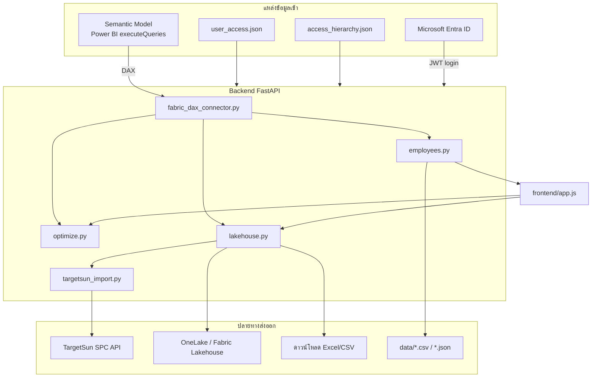

# เอกสารการดึง / ใช้ / ส่งข้อมูล — Target Allocation

เอกสารนี้อธิบายแหล่งข้อมูลทั้งหมดในระบบ รวมถึงตาราง Semantic Model (Power BI / Fabric) ที่ดึงผ่าน DAX REST API

**อัปเดต:** มิถุนายน 2026 · อ้างอิงโค้ด `backend/fabric_dax_connector.py`

---

## สรุปภาพรวม



---

## 1. Semantic Model (Power BI / Fabric)

### การเชื่อมต่อ

| รายการ | ค่า / ไฟล์ |
|--------|------------|
| Connector | `backend/fabric_dax_connector.py` → class `FabricDAXConnector` |
| API | `POST …/datasets/{FABRIC_DATASET_ID}/executeQueries` |
| Auth | Service Principal (`FABRIC_CLIENT_SECRET`) หรือ interactive user |
| Config | `config/.env` — `FABRIC_CLIENT_ID`, `FABRIC_TENANT_ID`, `FABRIC_DATASET_ID`, `FABRIC_WORKSPACE_ID` |
| Diagnostic | `python scripts/dev/test_powerbi_access.py` |

Frontend **ไม่** เรียก Power BI โดยตรง — ทุก DAX query รันฝั่ง server เท่านั้น

---

### 1.1 ตารางที่ดึงใน Runtime (ใช้งานจริง)

#### `Dim_Salesman`

| คอลัมน์ | การใช้งาน |
|---------|-----------|
| `SuperCode` | จับคู่ Supervisor ที่เลือกในแอป → รายชื่อพนักงาน |
| `ManagerCode` | ข้อมูล manager (index / validate) |
| `Area_NameThai` | ภาค (validate roster) |
| `SalesType` | 0=credit, 1=van |
| `SalesmanCode` | รหัสพนักงาน |
| `Salesman_NameThai` | ชื่อพนักงาน |

| Method | เรียกจาก | หน้าที่ |
|--------|----------|---------|
| `get_employees_by_manager(super_code)` | `employees.py` | รายชื่อพนักงานใต้ Supervisor |
| `get_supervisor_name(super_code)` | `employees.py` | ชื่อ Supervisor (fallback จาก `Dim_Super`) |
| `get_dim_salesman_supervisor_index()` | `scripts/access/validate_access_with_dim.py` | validate สิทธิ vs roster |

---

#### `Dim_Super`

| คอลัมน์ | การใช้งาน |
|---------|-----------|
| `Code` | รหัส Supervisor |
| `Namethai` | ชื่อภาษาไทย |

| Method | เรียกจาก |
|--------|----------|
| `get_supervisor_name()` | `employees.py` |

---

#### `Dim_Product`

| คอลัมน์ | การใช้งาน |
|---------|-----------|
| `ProductCode` | รหัส SKU |
| `Brand`, `Brand_NameThai` | แบรนด์ |
| `Product_NameThai`, `Product_NameEnglish` | ชื่อสินค้า |
| `Section` | หมวด |

| Method | เรียกจาก |
|--------|----------|
| `get_product_info(sku_list)` | `employees.py` |

---

#### `DimDate`

| คอลัมน์ | การใช้งาน |
|---------|-----------|
| `Date` | กรองช่วงเวลา YEAR/MONTH สำหรับประวัติขาย |

ใช้ร่วมกับ `cross_sold_history_2y_qu` ในทุก query ประวัติขาย

---

#### `cross_sold_history_2y_qu`

| คอลัมน์ | การใช้งาน |
|---------|-----------|
| `SalesmanCode` | รหัสพนักงาน |
| `ProductCode` | รหัส SKU |
| `TotalQuantity` | จำนวนหีบ |
| `Amount` | มูลค่า (บาท) |
| `WarehouseCode` | คลังสินค้า |

| Method | เรียกจาก | หน้าที่ |
|--------|----------|---------|
| `get_skus_sold_by_team()` | `employees.py` | SKU ที่ทีมเคยขาย |
| `get_historical_sales()` | `employees.py` | ประวัติ 3M / 6M |
| `get_calendar_year_sales_by_emp_sku()` | `employees.py` | ยอดปีปฏิทินปัจจุบัน |
| `get_same_month_prior_year_by_emp_sku()` | `employees.py` | ยอดเดือนเดียวกันปีก่อน |
| `get_prev_month_by_emp_sku()` | `employees.py` | ยอดเดือนก่อน |
| `get_latest_price_per_box_by_sku()` | `employees.py` | ราคา/หีบ จาก Amount÷Qty |
| `get_warehouse_by_emp()` | `employees.py`, `lakehouse.py` | คลังต่อพนักงาน |

---

#### `cfm_produc_master` *(ชื่อตารางใน model: produc ไม่ใช่ product)*

| คอลัมน์ | การใช้งาน |
|---------|-----------|
| `PRODUCTCODE` | รหัสสินค้า |
| `ACTUALCOSTPERUNIT`, `COSTPERUNIT` | ต้นทุน |

ดึงร่วมใน `get_product_info()`

---

#### `cfm_product_characteristic`

| คอลัมน์ | การใช้งาน |
|---------|-----------|
| `PRODUCTCODE` | รหัสสินค้า |
| `CREDITUNITPRICE` | ราคา/หน่วย (หลักสำหรับคำนวณเป้า Sun) |
| `PRODUCTSIZE` | กรอง `= 0` |
| `FROMDATE`, `TODATE` | ช่วงวันที่มีผล |

ดึงร่วมใน `get_product_info()` — ราคาใช้คำนวณ `target_sun` ใน `employees.py`

---

#### `tga_target_salesman_next` *(ชื่อเปลี่ยนได้ผ่าน env `TGA_TABLE_NAME`)*

| คอลัมน์ (default) | env override | การใช้งาน |
|-------------------|--------------|-----------|
| `SALESMANCODE` | `TGA_COL_SALESMAN` | รหัสพนักงาน |
| `PRODUCTCODE` | `TGA_COL_PRODUCT` | รหัส SKU |
| `QUANTITYCASE` | `TGA_COL_QUANTITY` | เป้าหีบ |
| `EFFECTIVEDATE` | `TGA_COL_EFFECTIVE` | วันที่มีผล |
| `UPDATEDATE` | `TGA_COL_EFFECTIVE_FALLBACK` | วันที่อัปเดต |
| `SALESTYPE` | `LAKEHOUSE_COL_SALESTYPE` | ประเภทขาย |
| `DIVISIONCODE` | `LAKEHOUSE_COL_DIVISION` | Division |
| `AREACODE` | `LAKEHOUSE_COL_AREACODE` | ภาค |
| `PROVINCECODE` | `LAKEHOUSE_COL_PROVINCE` | จังหวัด |
| `WAREHOUSECODE` | `LAKEHOUSE_COL_WAREHOUSE` | คลัง |

| Method | เรียกจาก | หน้าที่ |
|--------|----------|---------|
| `get_tga_max_effective_raw()` | `tga_period.py`, `optimize.py` | ตรวจช่วงเป้ามีข้อมูล |
| `get_tga_target_salesman_granular()` | `employees.py`, `lakehouse.py` | เป้าราย emp×sku |
| `get_tga_lakehouse_dims_by_emp_sku()` | `lakehouse.py` | เติม dim ก่อนส่ง TargetSun |
| `get_tga_lakehouse_dims_by_emp()` | `lakehouse.py` | fallback dim ต่อพนักงาน |

---

### 1.2 ตารางที่ไม่ใช้ใน Runtime แล้ว

ตารางเหล่านี้ยังอาจมีใน Semantic Model แต่ **ระบบปัจจุบันไม่ดึง** — สิทธิ์และ hierarchy ย้ายมาใช้ไฟล์ JSON แทน

| ตาราง | เคยใช้สำหรับ | แทนที่ด้วย |
|-------|--------------|------------|
| `trf_select_supervisor` | Dropdown Manager→Supervisor | `config/access_hierarchy.json` |
| `ACC_USER_CONTROL` | สิทธิ login (EMAIL, USERPL) | `config/user_access.json` |
| `acc_extra_user` | สิทธิเสริม | `config/user_access.json` + `can_import_targetsun` |

---

## 2. แหล่งข้อมูลอื่น (ไม่ใช่ Semantic Model)

| แหล่ง | ไฟล์ / บริการ | ใช้สำหรับ |
|-------|---------------|-----------|
| Microsoft Entra ID | JWT จาก `login.microsoftonline.com` | ล็อกอินผู้ใช้ (`backend/auth_entra.py`) |
| สิทธิผู้ใช้ | `config/user_access.json` | อีเมล → USERPL, division, scope, `can_import_targetsun` |
| ลำดับชั้น Manager→Supervisor | `config/access_hierarchy.json` | Dropdown `/managers`, กรองสิทธิ |
| Cache managers | `data/managers_cache.json` | เร่ง `/managers` (`MANAGERS_CACHE_TTL_SEC`) |
| Legacy CSV mode | `USE_LEGACY_TARGET_CSV=1` | ข้าม Fabric ใช้ `data/target_boxes.csv`, `data/target_sun.csv` |

### Workflow อัปเดตสิทธิ์ (ไม่ใช้ Fabric)

```bash
python scripts/access/import_user_access_from_division_xlsx.py
python scripts/access/rebuild_access_hierarchy.py
python scripts/access/validate_access_with_dim.py   # ใช้ Dim_Salesman validate เท่านั้น
python scripts/access/repair_user_access.py
# รีสตาร์ท server
```

---

## 3. API Endpoints → การดึงข้อมูล

| Endpoint | ดึงจาก Fabric? | ข้อมูลที่ได้ / ทำอะไร |
|----------|----------------|----------------------|
| `GET /auth/config` | ไม่ | MSAL config สำหรับ frontend |
| `GET /managers` | ไม่ | รายการ Manager/Supervisor จาก JSON cache |
| `GET /data/employees` | **ใช่** | Payload ขั้นที่ 1 ครบ: พนักงาน, SKU, เป้า, ราคา, ประวัติ |
| `GET /data/employees/aggregate` | **ใช่** | เหมือนข้างบน รวมหลาย Supervisor |
| `POST /optimize` | บางส่วน | ตรวจ TGA period (`MAX(EFFECTIVEDATE)`) |
| `POST /export/excel` | ไม่ | ส่งออก CSV จาก cache ขั้นที่ 1 |
| `GET /download/excel` | ไม่ | ดาวน์โหลดไฟล์ export |
| `POST /lakehouse/export-csv` | บางส่วน | สร้าง Excel TGA (เติม dim จาก Fabric ถ้า cache ไม่ครบ) |
| `POST /lakehouse/prepare-targetsun` | บางส่วน | เตรียมไฟล์ก่อนส่ง TargetSun |
| `POST /lakehouse/import-targetsun` | บางส่วน | ส่ง Excel ไป TargetSun API |
| `POST /lakehouse/upload` | บางส่วน | อัปโหลด CSV ไป OneLake |
| `GET /user-access` (+ CRUD) | ไม่ | จัดการ `user_access.json` (แอดมิน) |
| `GET /health` | ไม่ | health check |
| `GET /debug/fabric` | **ใช่** | debug DAX (`ENABLE_DEBUG_ENDPOINTS=1`) |

---

## 4. Frontend ใช้ข้อมูลอย่างไร

ไฟล์: `frontend/app.js`

| ขั้นตอน | API | ข้อมูลจาก Fabric (ผ่าน backend) |
|---------|-----|--------------------------------|
| Login | Entra MSAL | — |
| เลือก Manager/Supervisor | `GET /managers` | — (JSON) |
| ขั้นที่ 1 โหลดข้อมูล | `GET /data/employees` | Dim_Salesman, TGA, Dim_Product, cfm_*, cross_sold_history |
| ขั้นที่ 2 ตั้งเป้า | (ข้อมูลใน memory จากขั้น 1) | — |
| ขั้นที่ 3 คำนวณ | `POST /optimize` | ตรวจ TGA period |
| ส่ง Target Sun | `POST /lakehouse/prepare-targetsun` → `import-targetsun` | เติม dim จาก TGA table |
| ดาวน์โหลด Excel | `POST /lakehouse/export-csv` | เหมือนข้างบน |

---

## 5. Cache บน Disk (`data/`)

ลดการยิง DAX ซ้ำ — สร้างโดย `employees.py` และ services อื่น

| ไฟล์ cache | แหล่งข้อมูล |
|------------|-------------|
| `emp_cache_{sup}_{year}_{mm}.csv` | Dim_Salesman |
| `tga_lines_{sup}_{year}_{mm}.csv` | tga_target_salesman_next |
| `target_boxes.csv`, `target_sun.csv` | คำนวณจาก TGA + ราคา |
| `hist_cache_*` | cross_sold_history (3M/6M) |
| `hist_lysm_*` | cross_sold_history (เดือนเดียวกันปีก่อน) |
| `hist_prev_*` | cross_sold_history (เดือนก่อน) |
| `hist_cy_*` | cross_sold_history (ปีปฏิทิน) |
| `payload_cache_{sup}_{year}_{mm}.json` | payload ขั้นที่ 1 ทั้งก้อน |
| `managers_cache.json` | access_hierarchy (ไม่ใช่ Fabric) |
| `ts_prepare/*.xlsx` | ไฟล์ชั่วคราวก่อนส่ง TargetSun |

TTL: `EMPLOYEE_PAYLOAD_CACHE_TTL_SEC`, `MANAGERS_CACHE_TTL_SEC`

---

## 6. ปลายทางส่งข้อมูลออก (Outbound)

### 6.1 TargetSun SPC API

| รายการ | ค่า |
|--------|-----|
| ไฟล์ | `backend/services/targetsun_import.py` |
| URL default (UAT) | `https://spcuatws.sahapat.com/spc/targetsun/importTargetSalesmanNextFromExcel` |
| Env | `TARGETSUN_IMPORT_EXCEL_URL`, `TARGETSUN_IMPORT_*` |
| รูปแบบ | multipart POST ไฟล์ Excel |
| คอลัมน์ส่ง | `PRODUCTCODE`, `SALESTYPE`, `DIVISIONCODE`, `SALESMANCODE`, `AREACODE`, `PROVINCECODE`, `WAREHOUSECODE`, `QUANTITYCASE`, `EFFECTIVEDATE`, `UPDATEDATE`, `USERCODE` |
| เอกสาร API | `targetsun-importTargetSalesmanNextFromExcel.md` |

### 6.2 OneLake / Fabric Lakehouse

| รายการ | ค่า |
|--------|-----|
| ไฟล์ | `backend/services/lakehouse.py` |
| API | ADLS Gen2 REST (`onelake.dfs.fabric.microsoft.com`) |
| Auth | `https://storage.azure.com/.default` (แยกจาก Power BI scope) |
| Env | `ONELAKE_*`, `FABRIC_*` |

### 6.3 ดาวน์โหลด / Export ในเครื่อง

| ปลายทาง | ไฟล์ | รูปแบบ |
|---------|------|--------|
| Browser download | `exporting.py`, `lakehouse.py` | Excel / CSV |
| Local Excel template | `generate_excel.py` | สร้างไฟล์ allocation |

---

## 7. การยืนยันตัวตน (แยก 2 ชุด)

| ชุด | ใช้กับ | Scope / วิธี |
|-----|--------|--------------|
| Entra login | ผู้ใช้แอป | JWT — `AZURE_AUTH_CLIENT_ID`, `AZURE_AUTH_TENANT_ID` |
| Fabric SP | DAX executeQueries | `FABRIC_CLIENT_SECRET` → `analysis.windows.net/powerbi/api` |
| Azure Storage | OneLake upload | `storage.azure.com` |

---

## 8. โหมด Legacy

ตั้ง `USE_LEGACY_TARGET_CSV=1` ใน `.env` เพื่อข้ามการดึง Fabric ทั้งหมดใน Step 1 และใช้ไฟล์ CSV ที่เตรียมไว้ใน `data/` แทน

---

## 9. ไฟล์อ้างอิงในโค้ด

| หัวข้อ | ไฟล์หลัก |
|--------|----------|
| DAX connector | `backend/fabric_dax_connector.py` |
| โหลดข้อมูลขั้น 1 | `backend/services/employees.py` |
| ตรวจช่วง TGA | `backend/core/tga_period.py` |
| ส่ง TargetSun / OneLake | `backend/services/lakehouse.py`, `targetsun_import.py` |
| สิทธิ | `backend/services/access_control.py`, `user_access_store.py` |
| Config template | `config/.env.example` |
| สิทธิ / hierarchy | `config/README.md` |
