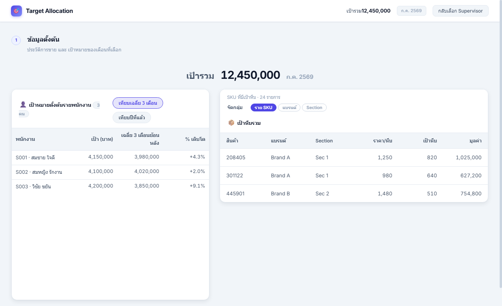
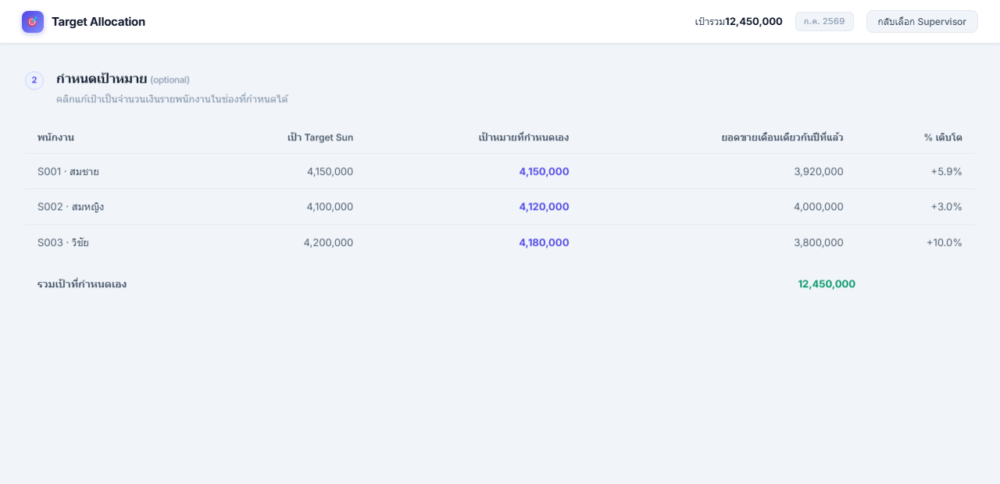
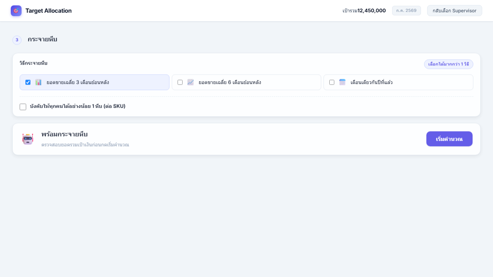
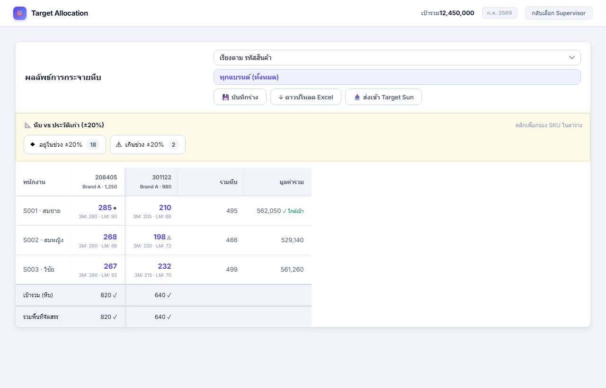
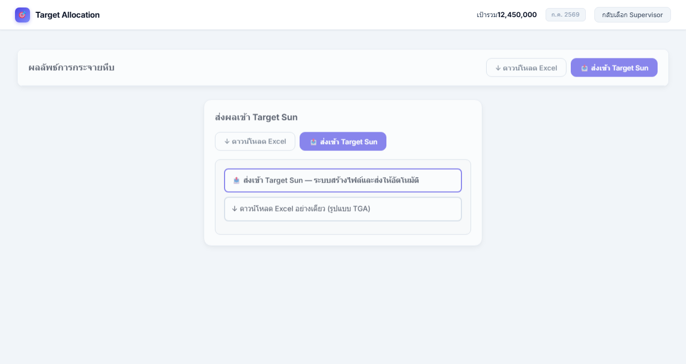

# คู่มือการใช้งาน Target Allocation

**ระบบกระจายเป้าหมาย (หีบ) ให้พนักงานขายรายคน**

ทำตามลำดับด้านล่างทีละขั้น ระบบดึงข้อมูลจากข้อมูลกลางอัตโนมัติ

---

## 1. เข้าสู่ระบบ

1. เปิด URL แอป: [https://spc-ai.sahapat.com/allocation_target/](https://spc-ai.sahapat.com/allocation_target/)
2. (แนะนำ) กด **อ่านคู่มือก่อนใช้งาน** บนการ์ดเข้าสู่ระบบ (อ่านได้ก่อนล็อกอิน) หรือกดปุ่ม **คู่มือ** มุมขวาบน
3. กด **ล็อกอินด้วย Microsoft** ด้วยบัญชีองค์กร
4. รอ dropdown **ผู้รับผิดชอบ (Supervisor / Manager)** โหลดเสร็จ
5. เลือกรหัสทีมที่ต้องการกระจายเป้า
6. เลือก **งวดเดือนที่จะกระจายเป้า** (ค่าเริ่มต้นมักเป็นเดือนถัดจากวันนี้)
7. กด **เข้าสู่ระบบ Dashboard**

---

## 2. ขั้นที่ 1: ข้อมูลตั้งต้น

1. ดู **เป้ารวม** ด้านบน (ยอดเงินรวมของงวดที่เลือก)
2. ตรวจตาราง **พนักงาน**: รหัส S/M, ชื่อ, เป้าเริ่มต้น
3. ตรวจตาราง **SKU (เป้าหีบ)**: รหัสสินค้า, แบรนด์, จำนวนหีบเป้ารวมต่อ SKU
4. สลับแท็บ **เทียบเฉลี่ย 3 เดือน** / **เทียบปีที่แล้ว** เพื่อดูบริบทเป้า
5. จัดกลุ่ม SKU เป็น **ราย SKU · แบรนด์ · Section** ตามต้องการตรวจ

---

## 3. ขั้นที่ 2: กำหนดเป้าหมาย (ไม่บังคับ)

ขั้นนี้ **ข้ามได้** ถ้าใช้เป้า Target Sun ตามที่ระบบดึงมาโดยไม่แก้

1. ดูคอลัมน์ **เป้าหมายที่กำหนดเอง** (ค่าเริ่มต้นเท่าเป้า Target Sun)
2. คลิกช่องแล้วพิมพ์ปรับเป้าเงินรายคน (ถ้าต้องการ)
3. ระบบคำนวณ **% เติบโต** ให้อัตโนมัติ
4. ตรวจ **ยอดรวมเป้าที่กำหนดเอง** ด้านล่าง ควรใกล้เป้ารวม

**เกณฑ์ยอดรวม**

| ส่วนต่างจากเป้ารวม | ความหมาย |
|---------------------|----------|
| ไม่เกิน ~10 บาท | พร้อมกด **เริ่มคำนวณ** (ขั้น 4) |
| ไม่เกิน ~99 บาท | แจ้งเตือน แต่ยังกดคำนวณได้ |
| มากกว่านั้น | ปุ่ม **เริ่มคำนวณ** ปิด ต้องปรับให้รวมใกล้เป้ารวม |

**ตัวเลือกเพิ่ม**

- **รีเซ็ตเป็น Target Sun**: คืนค่าเป้าที่กำหนดเองทุกคน
- **หักบิวเทรี่ยม**: เปิดช่องหักยอดจากยอดปีที่แล้วก่อนคิด % เติบโต (ใส่เฉพาะคนที่ต้องหัก)

**กรณีเติบโตติดลบ**

ถ้าเป้าที่ตั้งทำให้ **% เติบโตติดลบ** ระบบจะขอ **เหตุผล** อย่างน้อย 8 ตัวอักษร ก่อนกดคำนวณ  
(ถ้าเป้าเท่า Target Sun แล้วเติบโตติดลบอยู่ดี ไม่ต้องกรอกเหตุผล)

---

## 4. ขั้นที่ 3: กระจายหีบ

### เลือกวิธีกระจาย

เลือกได้ **มากกว่า 1 วิธี** (ติ๊กการ์ดด้านบน):

| วิธี | ความหมาย |
|------|----------|
| **ยอดขายเฉลี่ย 3 เดือนย้อนหลัง (L3M)** | แบ่งตามสัดส่วนยอด 3 เดือน (ค่าเริ่มต้น) |
| **ยอดขายเฉลี่ย 6 เดือนย้อนหลัง (L6M)** | แบ่งตามสัดส่วนยอด 6 เดือน |
| **เดือนเดียวกันปีที่แล้ว (LY)** | แบ่งตามยอดเดือนเดียวกันปีก่อน |
| **ผลักดันพนักงาน (PUSH)** | เน้นคนที่ขายน้อย ได้สัดส่วนมากขึ้น |

ถ้าเลือก **หลายวิธี** ให้กำหนด **แบรนด์ → วิธี** ในกล่องด้านล่าง

### ตัวเลือกเพิ่ม (checkbox)

- **บังคับให้ทุกคนได้อย่างน้อย 1 หีบ (ต่อ SKU)**: เมื่อเป้าหีบ SKU นั้น ≥ จำนวนพนักงาน
- **SKU ใหม่แบ่งเท่ากัน**: SKU ที่ทั้งทีมไม่มียอด 12 เดือน แบ่งเท่าทุกคน

### กดคำนวณ

1. เลือกวิธีกระจาย (และแบรนด์→วิธี ถ้าเลือกหลายวิธี)
2. ติ๊ก checkbox ตามต้องการ
3. ตรวจว่ายอดรวมเป้าเงินขั้น 2 พร้อม (ปุ่ม **เริ่มคำนวณ** เปิด)
4. กด **เริ่มคำนวณ** แล้วรอ progress 4 ขั้น
5. เมื่อเสร็จ ปุ่มเปลี่ยนเป็น **คำนวณใหม่** (ใช้เมื่อเปลี่ยนวิธีหรือแก้เป้า)

---

## 5. อ่านตารางผลลัพธ์

หลังกด **เริ่มคำนวณ** จะเห็นส่วน **ผลลัพธ์การกระจายหีบ** อ่านจาก**บนลงล่าง**ตามลำดับนี้

### 1) ปุ่มด้านบนตาราง

- **เรียงตาม** รหัสสินค้า / แบรนด์ / จำนวนหีบ / ราคา
- **เลือกแบรนด์** ดูเฉพาะแบรนด์หนึ่ง หรือทุกแบรนด์
- **💾 บันทึกร่าง** เก็บผลไว้ในเครื่อง · **↩️ Undo** ย้อนการแก้ล่าสุด · **↓ Excel** · **📤 ส่ง Target Sun**

### 2) แถบ 📐 หีบ vs ประวัติเก่า (±20%)

อยู่**ใต้ปุ่มด้านบน เหนือตาราง** มี 2 ปุ่ม:

- **◆ (ตัวเลข)** กดแล้วเห็นเฉพาะ SKU ที่หีบยังอยู่ในช่วง ±20% ของประวัติเก่า
- **⚠ (ตัวเลข)** กดแล้วเห็นเฉพาะ SKU ที่เกินช่วง ±20% (มักเกิดหลังแก้ตัวเลขเอง)

กดปุ่มเดิมอีกครั้ง หรือกด **แสดงทั้งหมด** เพื่อยกเลิกกรอง · ถ้าตัวเลขเป็น 0 ปุ่มจะกดไม่ได้

### 3) ตารางหีบ

| ดูตรงไหน | หมายความว่า |
|----------|-------------|
| **แถว** | พนักงานแต่ละคน |
| **คอลัมน์** | SKU แต่ละตัว (หัวคอลัมน์มีรหัสสินค้า แบรนด์ ราค/หีบ) |
| **ตัวเลขสีน้ำเงิน** | จำนวนหีบที่ได้ **คลิกแล้วแก้ได้** |
| **ตัวเลขสีเทาใต้ลงมา** | ประวัติยอดขาย (เฉลี่ย 3 เดือน, เดือนที่แล้ว, ปีที่แล้ว) |
| **คอลัมน์ขวาสุด** | รวมหีบและมูลค่ารวมของคนนั้น |

**สัญลักษณ์ ◆ และ ⚠** (ในเซลล์หรือที่หัวคอลัมน์)

- **◆** หีบยังอยู่ในช่วง ±20% ของประวัติเก่า (ปกติหลังระบบคำนวณ)
- **⚠** หีบเกินช่วง ±20% (มักหลังแก้มือ)

**มูลค่ารวมต่อคน** (คอลัมน์ขวา): **✓ ใกล้เป้า** = ห่างจากเป้าเงินไม่เกิน 1,000 บ. · ถ้า **ขาด/เกิน X บาท** = ยังห่างจากเป้าเงินมาก

### 4) แถวล่างสุดของตาราง

- **เป้ารวม (หีบ)** = เป้าหีบที่หัวหน้ากำหนดต่อ SKU
- **รวมพื้นที่จัดสรร** = หีบที่แบ่งให้พนักงานรวมกัน
- ควรเห็น **✓ สีเขียว** ทุกคอลัมน์ (รวมหีบตรงเป้า) ก่อนส่ง Target Sun

### 5) แก้หีบด้วยมือ

1. คลิกตัวเลขสีน้ำเงิน → พิมพ์จำนวนใหม่ → คลิกนอกช่อง
2. กด **↩️ Undo** ถ้าต้องการย้อน
3. กด **💾 บันทึกร่าง** เก็บไว้ในเครื่อง (ยังไม่ใช่การส่งเข้า Target Sun)

---

## 6. ส่งผล (Excel และ Target Sun)

### ดาวน์โหลด Excel (สรุปผล Dashboard)

1. กด **↓ ดาวน์โหลด Excel**
2. เลือกแบรนด์ (หรือ ALL)
3. ได้ไฟล์สรุปผลสำหรับเก็บ/ตรวจสอบ

### ส่งเข้า Target Sun

1. กด **📤 ส่งเข้า Target Sun**
2. จะมี**หน้าต่างยืนยันขึ้นมา** ให้เลือก **ส่งเข้า Target Sun** ระบบสร้างไฟล์และส่งให้อัตโนมัติ (ไม่ต้องแนบไฟล์)
3. หรือเลือก **ดาวน์โหลด Excel อย่างเดียว** รูปแบบ TGA สำหรับส่งด้วยตนเอง

### ก่อนส่ง ควรตรวจ

- [ ] คำนวณเสร็จแล้ว (มีตารางผล)
- [ ] แถวล่าง **รวมพื้นที่จัดสรร** ตรง **เป้ารวม (หีบ)** ทุก SKU (✓)
- [ ] แก้มือแล้วกดกรอง **⚠** ในแถบด้านบน ตรวจ SKU ที่เกินช่วง ±20%

สินค้าที่ไม่มีใน Target Sun จะไม่ถูกส่ง ระบบแจ้งจำนวนใน**หน้าต่างแจ้งผล**หลังส่ง

